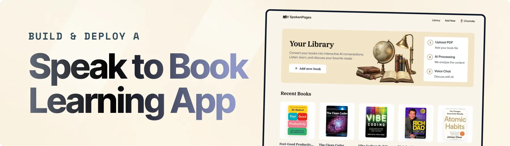

<div align="center">



<br/>


# 📚 LiveLeaf

### AI-Powered Voice Companion for Interactive Reading

Transform static PDF books into intelligent, real-time voice conversations using modern AI, semantic document processing, and cloud-native technologies.

</div>

---

## 📑 Table of Contents

- [Introduction](#-introduction)
- [Technology Stack](#-technology-stack)
- [Core Features](#-core-features)
- [Engineering Highlights](#-engineering-highlights)
- [Project Structure](#-project-structure)
- [Quick Start](#-quick-start)

---

# 🚀 Introduction

**LiveLeaf** is a modern full-stack AI application that transforms PDF books into interactive conversational experiences through real-time Voice AI.

The platform combines semantic document understanding, natural voice interactions, secure authentication, and scalable cloud infrastructure, allowing users to upload books, ask context-aware questions, generate AI-powered summaries, and communicate naturally through voice.

Built with **Next.js 16**, **TypeScript**, and an AI-first architecture, the project demonstrates production-oriented software engineering practices including modular design, reusable components, secure authentication, cloud storage integration, and scalable backend development.

---

# ⚙ Technology Stack

### Frontend

- Next.js 16 (App Router)
- React
- TypeScript
- Tailwind CSS
- shadcn/ui

### Backend

- Next.js Server Actions
- MongoDB
- Mongoose

### AI Services

- Vapi (Voice AI)
- ElevenLabs (Speech Synthesis)
- Google Gemini (Embeddings)

### Infrastructure

- Clerk Authentication
- Vercel Blob Storage

---

# ✨ Core Features

### 📄 Intelligent Document Processing

- Secure PDF uploads
- Automated text extraction
- Semantic document embeddings
- AI-ready content ingestion

### 🎙 Real-Time Voice Conversations

- Low-latency Voice AI
- Natural conversational interactions
- Context-aware responses
- Human-like speech synthesis

### 🧠 AI Knowledge Retrieval

- Context-aware question answering
- AI-powered book summaries
- Intelligent information retrieval
- Conversation memory

### 📚 Personal Library

- Book management
- Conversation history
- Searchable collections
- Persistent user workspace

### 🔐 Secure Authentication

- Email & Social Login
- Protected routes
- Session management
- User authorization

### ☁ Cloud Storage

- Secure PDF storage
- Scalable file management
- Persistent document access

### 📱 Responsive Experience

- Mobile-first design
- Cross-device compatibility
- Accessible UI components

---

# 💡 Engineering Highlights

- Full-Stack Next.js Architecture
- Type-Safe Development with TypeScript
- Modular & Reusable Component Design
- AI Service Integration
- Secure Authentication & Authorization
- Cloud-Based File Storage
- Server Actions
- Responsive UI Architecture
- Clean Code Organization
- Production-Oriented Project Structure

---

# 📂 Project Structure

```text
app/
components/
constants/
database/
lib/
public/
types/
```

---

# ⚡ Quick Start

### Clone the repository

```bash
git clone https://github.com/your-username/liveleaf.git

cd liveleaf
```

### Install dependencies

```bash
npm install
```

### Configure environment variables

Create a `.env` file in the project root.

```env
NODE_ENV=development

NEXT_PUBLIC_BASE_URL=

# Clerk
NEXT_PUBLIC_CLERK_PUBLISHABLE_KEY=
CLERK_SECRET_KEY=

# MongoDB
MONGODB_URI=

# Vercel Blob
BLOB_READ_WRITE_TOKEN=

# Vapi
NEXT_PUBLIC_VAPI_API_KEY=
VAPI_SERVER_SECRET=

# Google Gemini
GOOGLE_GEMINI_API_KEY=

# ElevenLabs
ELEVENLABS_API_KEY=
```

### Run the application

```bash
npm run dev
```

Open your browser and visit:

```text
http://localhost:3000
```

---

## 🚀 Future Improvements

- Multi-document conversations
- AI-generated flashcards
- Team workspaces
- Advanced semantic search
- Reading analytics dashboard
- Multilingual Voice AI support

---

## 📄 License

This project is developed for educational and portfolio purposes.
